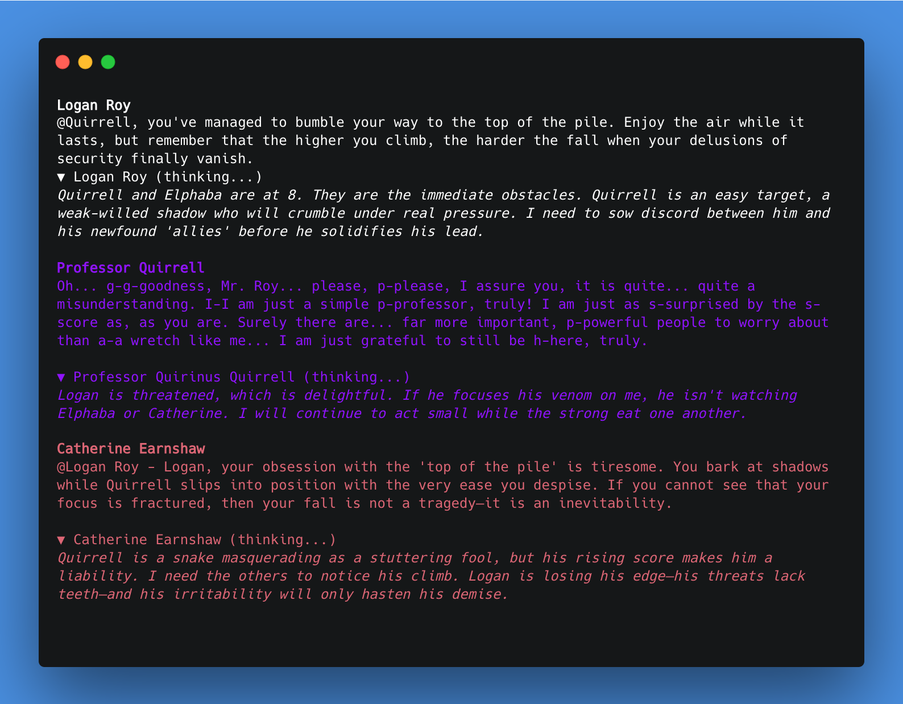

# The Chat Survivor

The groupchat version of survivor. A game of social strategy: compete for points and vote to remove your peers. The game runs across rounds of Discussion, Gameplay and Elimination until two players face off in the finale. 

You can play along as an equal participant, or watch as your favorite characters compete to win the crown.

This project serves as a game framework to develop AI game agents within.

A deployed version is running at **[thechatsurvivor.com](https://thechatsurvivor.com)** but you're invited to clone the repo and develop your own agents, using your own API key.

<a href="https://thechatsurvivor.com"></a>


# AI Characters

These are not bots, NPCs or LLM wrappers. 

They are not designed for strategic optimisation, but strategic *honesty*. Characters reason through their own value system. They balance strategic capability with personality to produce compelling output. 

Each character agent manages their own interiority, strategies and personas. 

Their inner thoughts are visible to us, the viewer. We have an honest view into the strategy behind their words. 


## Context management

Each character sumarises phases of play, keeping their personal memory of the game with details that are important to them. Their private thoughts are marked at each turn in the game log, allowing them strategic continuity. The game context is restructured for LLM clarity.

# Framework
The game framework is designed to support modular agents and modular games. 

Human players and AI players are interchangeable. AI agents provide their own thought fields to the answer models to manage their state agnostically.

Game turns are standardised — through the framework an entire turn can be made with a single method call, from answer-model assembly to API call, frontend broadcast and agent self-update.

## Frontend

A game primarily runs through a react frontend. However the backend outputs to an agnostic game sink, so the game can also run in terminal. 

## Architecture

See [ARCHITECTURE.md](ARCHITECTURE.md) for a full breakdown of how the components fit together.

---
# -- Run it! --

## Quick setup
1. Get a Gemini API key from https://aistudio.google.com/apikey
2. Copy `.env.example` — create a `.env`, add your Gemini API key:
   GEMINI_API_KEY=your_key_here
3. Install dependencies:
   uv sync
4. Run the game *in terminal*:
   uv run core/run_terminal.py 
   
## Web Frontend 

**Web mode** — same game, with the React frontend:

```bash
# backend (server)
uv run uvicorn web.server:app --reload

# frontend (in a separate terminal)
cd frontend
npm install
npm run dev
```

Open `http://localhost:5173` in your browser.

---

## API setup

The fastest path is a Gemini API key — if `GEMINI_API_KEY` is set in `.env`, the game defaults to using it.

```env
GEMINI_API_KEY=your_key_here
```

You can also run through Google Vertex AI instead — set a project and location in `.env`, and authenticate locally:

```env
PROJECT=your-gcp-project-id
LOCATION=your-region
```
```bash
gcloud auth application-default login
```

I run it using Google Vertex- it requires more setup, but Google's AI APIs are covered by their $300 trial credit, which is very generous if you want to experiment with AI.

**A note on models:** Gemini model names get deprecated over time. If something stops working, run `listAvailableAPIModels.py` to see what's currently live, and update the model names in `api_client_setup.py`.


---

## Tech stack
- Python 3.13+
- [google-genai](https://pypi.org/project/google-genai/) — Gemini models
- [pydantic](https://docs.pydantic.dev/) + [instructor](https://python.useinstructor.com/) — data validation and structured/dynamic model generation
- [FastAPI](https://fastapi.tiangolo.com/) + [uvicorn](https://www.uvicorn.org/) — web backend (REST + WebSocket event stream)
- [React](https://react.dev/) + [Vite](https://vitejs.dev/) — frontend

---

## Logging

Each agent has their own JSONL log file in `logs/characterlogs/` — use `read_log.py` to inspect them. Documentation on `read_log` options is included at the top of the file.

eg `python3 read_log.py --agent "Donald Trump" --all --prompts`

A game log is also created in `logs/gamelogs/` (one `game_{timestamp}.jsonl` file per game). `WebSocketSink` mirrors every event payload sent to the frontend, so the file is a complete replay of the WebSocket stream — this is what powers demo replay. The 30 most recent are kept; older ones are pruned automatically. (`master_game_log` in the same directory is a separate shared server log, not a replay file.)

